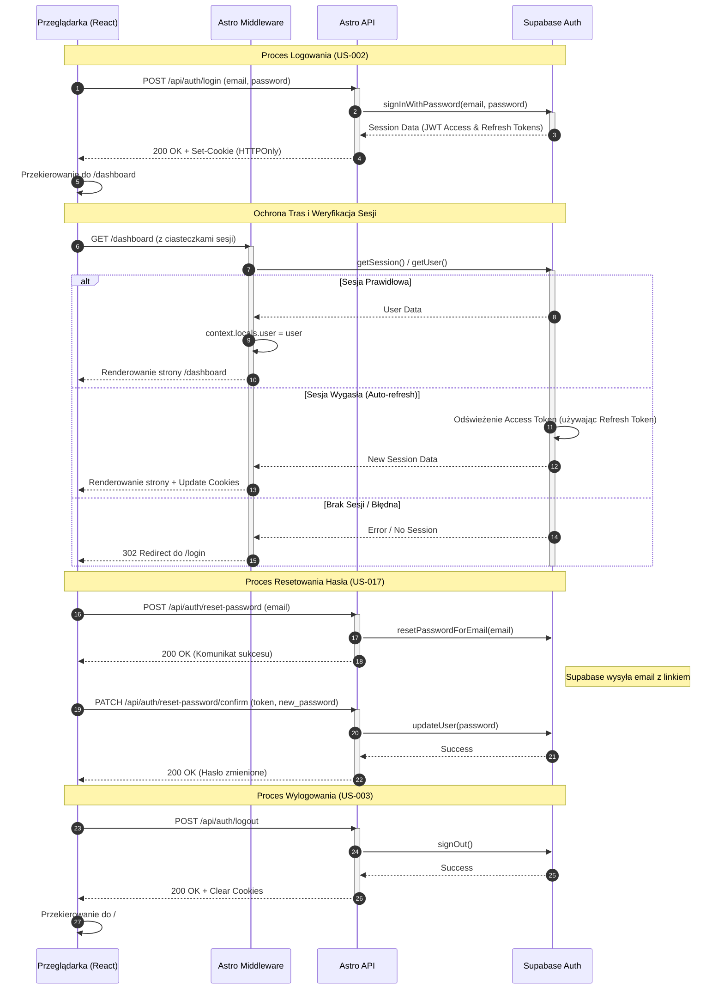

# Architektura Autentykacji - Przepływy Sekwencyjne

```mermaid
sequenceDiagram
    autonumber
    participant B as Przeglądarka (React)
    participant M as Astro Middleware
    participant A as Astro API
    participant S as Supabase Auth

    Note over B, S: Proces Logowania (US-002)
    B->>A: POST /api/auth/login (email, password)
    activate A
    A->>S: signInWithPassword(email, password)
    activate S
    S-->>A: Session Data (JWT Access & Refresh Tokens)
    deactivate S
    A-->>B: 200 OK + Set-Cookie (HTTPOnly)
    deactivate A
    B->>B: Przekierowanie do /dashboard

    Note over B, S: Ochrona Tras i Weryfikacja Sesji
    B->>M: GET /dashboard (z ciasteczkami sesji)
    activate M
    M->>S: getSession() / getUser()
    activate S
    alt Sesja Prawidłowa
        S-->>M: User Data
        M->>M: context.locals.user = user
        M-->>B: Renderowanie strony /dashboard
    else Sesja Wygasła (Auto-refresh)
        S->>S: Odświeżenie Access Token (używając Refresh Token)
        S-->>M: New Session Data
        M-->>B: Renderowanie strony + Update Cookies
    else Brak Sesji / Błędna
        S-->>M: Error / No Session
        M-->>B: 302 Redirect do /login
    end
    deactivate S
    deactivate M

    Note over B, S: Proces Resetowania Hasła (US-017)
    B->>A: POST /api/auth/reset-password (email)
    activate A
    A->>S: resetPasswordForEmail(email)
    A-->>B: 200 OK (Komunikat sukcesu)
    deactivate A
    Note right of S: Supabase wysyła email z linkiem

    B->>A: PATCH /api/auth/reset-password/confirm (token, new_password)
    activate A
    A->>S: updateUser(password)
    S-->>A: Success
    A-->>B: 200 OK (Hasło zmienione)
    deactivate A

    Note over B, S: Proces Wylogowania (US-003)
    B->>A: POST /api/auth/logout
    activate A
    A->>S: signOut()
    S-->>A: Success
    A-->>B: 200 OK + Clear Cookies
    deactivate A
    B->>B: Przekierowanie do /
```
