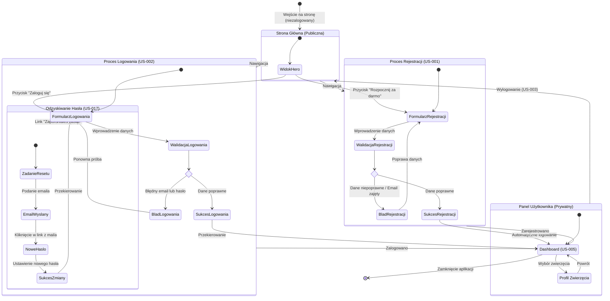

# Podróż Użytkownika - Moduł Uwierzytelniania

```mermaid
stateDiagram-v2
    [*] --> LandingPage: Wejście na stronę (niezalogowany)

    state "Strona Główna (Publiczna)" as LandingPage {
        [*] --> WidokHero
        WidokHero --> FormularzRejestracji: Przycisk "Rozpocznij za darmo"
        WidokHero --> FormularzLogowania: Przycisk "Zaloguj się"
    }

    state "Proces Rejestracji (US-001)" as Rejestracja {
        [*] --> FormularzRejestracji
        FormularzRejestracji --> WalidacjaRejestracji: Wprowadzenie danych

        state choice_reg <<choice>>
        WalidacjaRejestracji --> choice_reg
        choice_reg --> BladRejestracji: Dane niepoprawne / Email zajęty
        choice_reg --> SukcesRejestracji: Dane poprawne

        BladRejestracji --> FormularzRejestracji: Poprawa danych
        SukcesRejestracji --> Dashboard: Automatyczne logowanie
    }

    state "Proces Logowania (US-002)" as Logowanie {
        [*] --> FormularzLogowania
        FormularzLogowania --> WalidacjaLogowania: Wprowadzenie danych

        state choice_log <<choice>>
        WalidacjaLogowania --> choice_log
        choice_log --> BladLogowania: Błędny email lub hasło
        choice_log --> SukcesLogowania: Dane poprawne

        BladLogowania --> FormularzLogowania: Ponowna próba
        FormularzLogowania --> ResetHasla: Link "Zapomniałeś hasła?"
        SukcesLogowania --> Dashboard: Przekierowanie
    }

    state "Odzyskiwanie Hasła (US-017)" as ResetHasla {
        [*] --> ZadanieResetu
        ZadanieResetu --> EmailWyslany: Podanie emaila
        EmailWyslany --> NoweHaslo: Kliknięcie w link z maila
        NoweHaslo --> SukcesZmiany: Ustawienie nowego hasła
        SukcesZmiany --> FormularzLogowania: Przekierowanie
    }

    state "Panel Użytkownika (Prywatny)" as Prywatny {
        state "Dashboard (US-005)" as Dashboard
        state "Profil Zwierzęcia" as Profil

        [*] --> Dashboard
        Dashboard --> Profil: Wybór zwierzęcia
        Profil --> Dashboard: Powrót
    }

    Prywatny --> LandingPage: Wylogowanie (US-003)

    LandingPage --> Rejestracja: Nawigacja
    LandingPage --> Logowanie: Nawigacja
    Logowanie --> Dashboard: Zalogowano
    Rejestracja --> Dashboard: Zarejestrowano

    Dashboard --> [*]: Zamknięcie aplikacji
```
