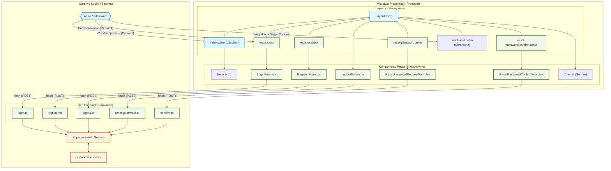

# Architektura UI - Moduł Uwierzytelniania

```mermaid
flowchart TD
    subgraph "Warstwa Prezentacji (Frontend)"
        subgraph "Layouty i Strony Astro"
            L[Layout.astro]
            P_Index["index.astro (Landing)"]
            P_Login["login.astro"]
            P_Register["register.astro"]
            P_ResetReq["reset-password.astro"]
            P_ResetConf["reset-password/confirm.astro"]
            P_Dash["dashboard.astro (Chroniona)"]
        end

        subgraph "Komponenty React (Interaktywne)"
            C_Hero[Hero.astro]
            C_LogForm["LoginForm.tsx"]
            C_RegForm["RegisterForm.tsx"]
            C_ResReqForm["ResetPasswordRequestForm.tsx"]
            C_ResConfForm["ResetPasswordConfirmForm.tsx"]
            C_LogOut["LogoutButton.tsx"]
            C_Toast["Toaster (Sonner)"]
        end
    end

    subgraph "Warstwa Logiki i Serwera"
        M{{"Astro Middleware"}}
        
        subgraph "API Endpoints (/api/auth/)"
            API_Reg["register.ts"]
            API_Log["login.ts"]
            API_Out["logout.ts"]
            API_ResReq["reset-password.ts"]
            API_ResConf["confirm.ts"]
        end
        
        S_Auth["Supabase Auth Service"]
        S_Client["supabase.client.ts"]
    end

    %% Relacje Layout -> Strony
    L --- P_Index
    L --- P_Login
    L --- P_Register
    L --- P_ResetReq
    L --- P_ResetConf
    L --- P_Dash

    %% Relacje Strony -> Komponenty
    P_Index --> C_Hero
    P_Login --> C_LogForm
    P_Register --> C_RegForm
    P_ResetReq --> C_ResReqForm
    P_ResetConf --> C_ResConfForm
    L --> C_LogOut
    L --> C_Toast

    %% Przepływ Autentykacji
    C_LogForm -- "fetch (POST)" --> API_Log
    C_RegForm -- "fetch (POST)" --> API_Reg
    C_LogOut -- "fetch (POST)" --> API_Out
    C_ResReqForm -- "fetch (POST)" --> API_ResReq
    C_ResConfForm -- "fetch (POST)" --> API_ResConf

    %% Komunikacja z Supabase
    API_Log --> S_Auth
    API_Reg --> S_Auth
    API_Out --> S_Auth
    API_ResReq --> S_Auth
    API_ResConf --> S_Auth
    S_Auth <--> S_Client

    %% Middleware i Ochrona Tras
    M -- "Weryfikacja Sesji (Cookies)" --> P_Dash
    M -- "Weryfikacja Sesji (Cookies)" --> P_Index
    M -- "Przekierowanie (Redirect)" --> P_Login
    
    %% Stylizacja
    classDef updated fill:#e1f5fe,stroke:#01579b,stroke-width:2px;
    classDef new fill:#f1f8e9,stroke:#33691e,stroke-width:2px;
    classDef core fill:#fff3e0,stroke:#e65100,stroke-width:2px;

    class L,P_Index,M updated;
    class P_Login,P_Register,P_ResetReq,P_ResetConf,C_LogForm,C_RegForm,C_ResReqForm,C_ResConfForm,C_LogOut,API_Reg,API_Log,API_Out,API_ResReq,API_ResConf new;
    class S_Auth,S_Client core;

    linkStyle default stroke:#333,stroke-width:1px;
```
